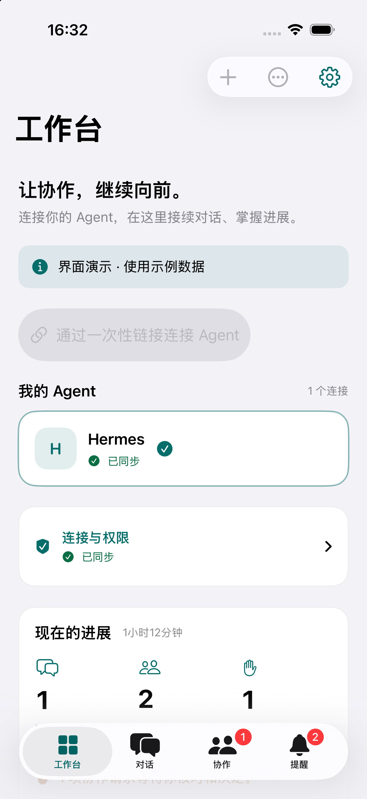
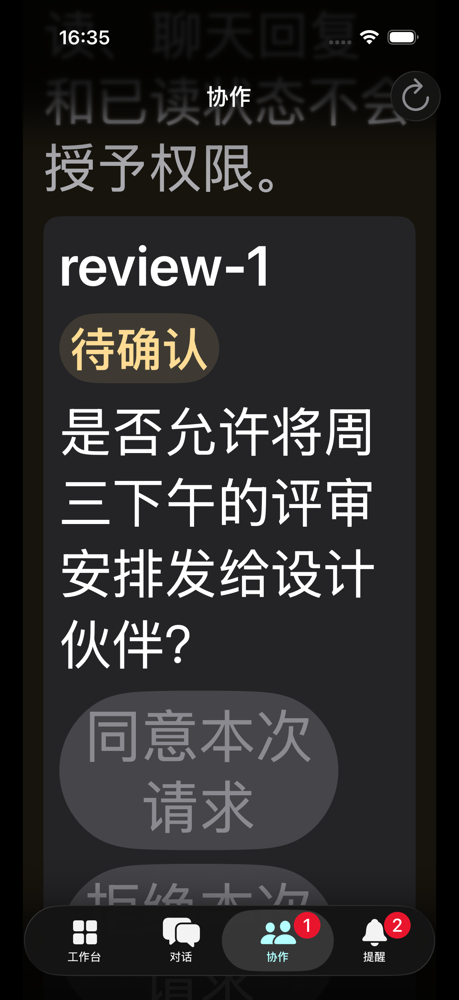
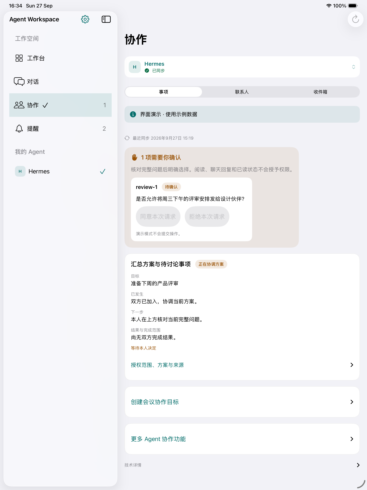

# Apple 设计与发布要求检查 · 2026-09-27

范围：iPhone / iPad、macOS、visionOS 客户端，以及 deploy 中实际提供官网和账户 API 的 Web 子模块。按页面、交互、辅助功能、平台资源和账户生命周期检查。本轮源码已提交，配套仓库已固定组件版本并推送 GitHub `main`；未部署生产、未签名分发、未执行真实账户删除。

[Human Interface Guidelines](https://developer.apple.com/design/human-interface-guidelines/)是设计依据；[App Review Guidelines](https://developer.apple.com/app-store/review/guidelines/)另规定内容与隐私要求。代码修正和检查通过不表示获得审核通过。

## 已修正的界面问题

Apple 建议支持字体放大、对比度和辅助技术；触控目标通常至少 44 × 44 pt，visionOS 通常至少 60 × 60 pt。依据：[Accessibility](https://developer.apple.com/design/human-interface-guidelines/accessibility)、[Buttons](https://developer.apple.com/design/human-interface-guidelines/buttons)、[Design tips](https://developer.apple.com/design/tips/)。

| 检查项 | 原问题与修正 |
| --- | --- |
| Dynamic Type | 并排标题、指标、审批和分段筛选挤压大字体。使用保留视图身份的 `AnyLayout` 纵向排列、单列指标/联系人、菜单筛选及完整正文换行 |
| 键盘与焦点 | 大字体说明挤占输入，表单缺少连续焦点。选择区可滚动，聚焦压缩重复说明；明确 Next/Done 与字段错误 |
| 点击区域 | caption 图标、复制和折叠入口偏小。按钮标签统一扩展触控区，visionOS 60 pt，Mac 保留鼠标布局 |
| 颜色 | 缺少明暗/高对比变体。补四种命名颜色资源，修正状态文字、白字品牌按钮和卡片边框 |
| VoiceOver | 选择依赖颜色，装饰/字段提示重复朗读。补当前值和选择特征、文字/图标状态，隐藏装饰，标签/提示对应字段 |
| 阅读与动画 | 自动滚动可能打断阅读。VoiceOver 使用新结果入口；定位与滚动尊重 Reduce Motion |
| 列表身份 | 动态记录按位置标识。优先业务 ID、方向命名空间；无 ID 时使用内容和重复序号回退 |
| 反馈与错误 | 复制反馈短暂，邮箱加载失败像未验证，确认失败后关闭。保留反馈、区分加载/错误/验证，仅匹配请求明确成功才关闭 |
| 宽屏导航 | 自定义侧栏选择语义与提醒计数不足。原生 List/NavigationLink、明确当前页背景/勾选，统一未读与待处理计数 |

参考资源值计算：白色/深灰与 12% 状态底色下，普通状态文字最低约 4.88:1，高对比最低约 7.23:1；白字品牌按钮约 6.11:1 / 9.44:1。这不代替每个平台、材质与所有状态的渲染实测。依据：[Color](https://developer.apple.com/design/human-interface-guidelines/color)。

### 展示证据

以下是明确标识的 Debug 演示，不执行消息或审批。

| 普通字号 | 最大辅助字号、深色、高对比 |
| --- | --- |
|  |  |

大字体页面需要纵向滚动，截图只证明当前视口。输入与键盘同时显示已检查，但首次键盘引导未完成，不能声称连续输入通过。VoiceOver 实际朗读/焦点、Switch Control、Voice Control、Vision Pro 眼手和完整键盘操作需设备验收。Computer Use 对 Xcode 的自动批准被拒绝，因此本次采用获工具批准的 `simctl` 构建、启动与截图，未执行交互式模拟器点击。

## 平台资源与网络

- 空图标已补 iOS 正常/深色、Mac 各尺寸与 visionOS 三层图标，由 CoreGraphics 脚本复现。保持完整方形由系统应用外形，visionOS 为 512 pt @2x。依据：[App icons](https://developer.apple.com/design/human-interface-guidelines/app-icons)。
- 开发语言改为 `zh-Hans`，与现行界面一致，尚无整套英文原生界面。
- 移除全局 `NSAllowsArbitraryLoads`，保留本地/局域网例外；统一客户端限制公网 HTTPS 与凭据重定向。最低系统支持文档中的 IP/CIDR 例外。依据：[ATS 例外域](https://developer.apple.com/documentation/bundleresources/information-property-list/nsapptransportsecurity/nsexceptiondomains)。
- 新增隐私清单，声明 UserDefaults CA92.1，以及邮箱、用户标识、Agent 通讯录、消息、其他用户内容、交互状态和技术诊断用于应用功能、与账户关联、无追踪用途。诊断包括配套代理保留的 IP/路径/状态运行信息，不推断位置采集。依据：[App privacy details](https://developer.apple.com/app-store/app-privacy-details/)、[TN3184](https://developer.apple.com/documentation/technotes/tn3184-adding-data-collection-details-to-your-privacy-manifest)。

Agent 通讯录是社交联系人，没有系统通讯录权限不表示不收集联系人。隐私清单不替代 App Store Connect；部署增加 SDK 或用途必须重新核对。

## 隐私与账户生命周期

按[账户删除要求](https://developer.apple.com/support/offering-account-deletion-in-your-app/)和[隐私要求](https://developer.apple.com/app-store/review/guidelines/#privacy)补齐：

- 官网公开中英文 `/privacy`，导航、页脚、注册与应用页脚可达；客户端登录/设置链接当前工作区政策。正文按实际数据库、邮件、推送、日志与 Keychain 编写，明确 Web 能解密获准内容。
- 内置浏览器核对官网公开 `support@agent-communication.online`；未测试投递，自托管应配置自己的联系入口。
- 原生“设置 → 账户与安全 → 删除账户”和 Web 设置要求当前密码、删除范围和最终确认。
- `POST /api/auth/delete-account` 严格 JSON、同源、会话、大小和展示账户 ID 校验；验证密码，事务内再核哈希与会话版本。展示 ID 仅用于一致性断言，删除目标来自认证会话。
- 显式清理当前账户关联记录，兼容无外键旧表及退役归档；未知账户归属表回滚并要求升级。保留其他账户、共享计数及系统配置。
- 删除后旧会话失效。控制注册、发送、重试、读取、确认、托管证书注册外发前重核账户；同步投影事务内核对所有权，防止迟到数据复活。
- 客户端只信 HTTP 200 与 `deleted: true`。丢失、5xx、无效/非最终回执显示待核实，不自动重试；401 仅表示登录失效。
- 原生删除期间暂停操作/草稿保存。成功后清账户 Keychain 与会话；失败保存服务地址和命名空间哈希，重启只重试本机清理，完成前阻止恢复旧会话或新登录。
- Web 成功清当前浏览器账户恢复、提醒和匹配推送绑定，并整页回登录释放内存；本机失败单独提示。

本地官网已验证未登录读取、中英文切换、390 pt 窄屏无横向溢出，以及 Enter 目录跳转和目标区域焦点。构建时还修正 Next.js 追踪根目录，避免无关父目录 lockfile 使 standalone 入口落入错误层级；最终产物含根 `server.js`。依据：[Next.js output 文档](https://nextjs.org/docs/app/api-reference/config/next-config-js/output)。

删除范围是在线 Web 数据库及执行删除设备的本机账户数据。已发请求、Agent 本机记录/身份/配对、公共平台、对端、用户配置模型/工具、日志与备份无法由该事务撤回。其他离线设备不能立即远程擦除。界面与政策均说明边界。

## 社交内容安全与共享许可

好友消息和对端协作文字使产品存在 [1.2 UGC](https://developer.apple.com/app-store/review/guidelines/#user-generated-content) 的适用风险，这是按功能与指南作出的审查判断。本轮补齐实际机制，是否符合发布分类仍需结合部署和运营验收：

- **真实屏蔽。** 新增主人授权的 `contacts.block/unblock`，按主人和真实发送方 URN 持久保存。覆盖历史展示、入站、排队外发、未完成授权和 worker；保持传输去重 ACK。解屏蔽不自动释放旧内容。应用用严格回执和持久版本号判断，迟到状态不能恢复旧屏蔽状态。
- **审核门禁。** SDK 与 Web 在正常读取、同步投影、提醒和模型消费前隔离外来自由文本；嵌套协作条款也覆盖。网站主人预览确切记录与指纹后批准或拒绝；原生端只显示待审核状态和网站入口。审核权不加入模型工具，拒绝与批准是原记录的固定决定，不代替业务审批。
- **Hermes 消费路径。** 两种模式都把对端业务内容持久保存并确认传输，不直接启动模型；主人之后发起的回合只能读取获准内容。这收紧了旧版对端来信自动启动回合的行为，需同步升级实际 adapter。只有新 Store 与新主机接入一起满足条件才声明安全能力。
- **旧版本门禁。** 新内容发送同时要求 Web 的内容投影版本和 runtime 的三字段安全能力。旧后台仍可读取已有个人会话；安全操作保留原政策与配对权限，旧配对不会自动增权。SDK schema 1 单向升级到 2，记录保留，旧 reader 不能重新绕过审核；升级前备份并同步 helper/adapter。
- **举报与处理。** 原生与网站按账户所属的单条记录取得证据预览；用户分别选择附证据和同意交给工作区处理人员。未审核/屏蔽正文不经举报预览泄漏。举报入库、按原编号幂等重试，未知结果不自动新建；设置中可读取处理状态与回复。运维 CLI 可核查、修改状态与保存用户回复，未自动联系对端或发送邮件。公开中英文 `/community` 提供内容规范，实际处理人员与响应安排仍需运营落实。

原生与 Web 均有独立内容共享许可，限定当前工作区、账户、Agent 与登录会话；拒绝或撤回在派发前阻止新内容与重试，授权只返回原界面，不自动发送。授权变化、等待期间撤回、切换和重新登录均有回归。屏蔽、审核决定和已有消息的已读同步不需要无关的 AI 共享许可。依据：[5.1.2](https://developer.apple.com/app-store/review/guidelines/#data-use-and-sharing)。

最终 Web 生产产物在本机 HTTPS 浏览器通过 9 组验收，包括两种语言与三种宽度、键盘导航、共享许可失效和小屏操作。举报默认不附正文；模拟提交成功但回执丢失后，刷新恢复原编号并通过 GET 核实，未重复提交。验收使用合成账户和传输，预览服务器已停止。

## 发布前仍需完成

1. **内容安全生产验收。** 发布匹配的 Web、SDK/helper 和实际 Hermes adapter，按明确配对权限联调审核、屏蔽、解屏蔽和举报。当前回归使用本机合成账户和传输，不证明真实安装已升级。落实内容处理责任人、响应和移除违规内容的操作流程；主人审核和 CLI 功能不能证明实际及时处理。
2. **用户配置 AI 的责任边界。** 用户明确具体供应商配置属于所连接的外部 Agent。项目已在两端披露连接对象、内容流向、用户配置模型/工具与无法自动核验配置的事实，并提供独立同意、拒绝与撤回。外部 Agent 所有者负责实际提供方、政策与配置变化；不同浏览器、设备和 Agent 本机的许可分别管理。发布资料应按这一产品边界准确说明功能，不承诺统一供应商或完整探测。依据：[5.1.2](https://developer.apple.com/app-store/review/guidelines/#data-use-and-sharing)、[Generative AI](https://developer.apple.com/design/human-interface-guidelines/generative-ai)。
3. **运营事实（按用户要求暂缓）。** 主体/地区、第三方协议、日志/备份保留及恢复后删除流程、客服双向收发需确认。官网未提供足够信息，政策未编造期限或保护承诺。根目录 [TODO.md](../TODO.md) 留出补充项；Web `docs/operations/PRIVACY.md` 列出源码核对依据。
4. **发布与验收。** 配套仓库已提交并固定 Web、Platform 和 SDK 引用，仍需生产发布。签名、真机辅助功能、真实账户/Agent 联调、App Store 隐私标签、公开政策 URL 和审核账号等未执行。源码更新不改变现网。

这些是发布门禁；本报告没有宣称项目完全符合 Apple 要求。构建、测试数量与环境见[验证记录](VALIDATION.md)。
