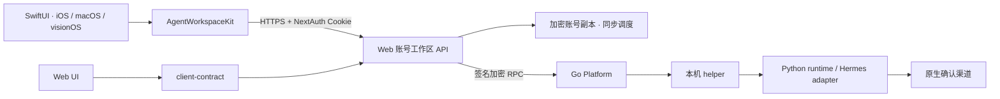

# 远程工作台兼容架构

[返回使用介绍](../README.md) · [安装与服务端版本要求](DEVELOPMENT.md#服务端版本与兼容检查)

本文记录 Apple 客户端的接口约定及配套 Web 架构。2026-09-14 拉取后核对的 Web `d56bf35` 包含下表的工作区路由和图中的 `client-contract` 共享模块；Apple `b2ad755` 中的 7 份协议 fixtures 与该模块的文件集合、SHA-256 全部一致。源码比对、历史测试记录和线上部署状态应分别核对。

## 边界

Agent runtime 是联系人、协作范围、确认、会话执行的权威来源。Web 提供账号、远程连接记录、控制台身份及加密同步副本。客户端不重新创建旧版 Web 业务数据库，不持有 Agent 身份私钥，也不绕过本机配对。

Web 将可复用的协议规则放在零运行依赖的 `packages/client-contract`，接口校验、客户端与后台同步直接复用该模块；其 JavaScript 实现、TypeScript 声明、JSON Schema 与 fixtures 为其他客户端提供接入参考。Swift 包不依赖相邻仓库路径，Xcode 工程只引用本仓库里的本地包；测试中保存协议 fixtures，避免两仓库运行时耦合。

## 已接入 API

| 路由 | 方法 | 客户端用途 |
| --- | --- | --- |
| `/api/auth/csrf`、`callback/credentials`、`session`、`register`、`signout` | GET/POST | NextAuth 完整账号流程 |
| `/api/workspace` | GET | 连接列表与同步状态 |
| `/api/agents` | POST | 保存真实 Agent 连接（仅 name、urn） |
| `/api/agents/:id/bind-owner` | POST | 注册/恢复同一个控制台身份 |
| `/api/agents/:id/workspace` | GET | 快照、会话、历史页及未决提交 |
| 同上 | POST | select_conversation、dismiss_submission |
| `/api/workspace/sync` | POST | 安排账号/Agent 同步 |
| `/api/agents/:id/control` | POST/GET | 提交六种受限 RPC，并轮询同一个 request_id |

没有假设 DELETE 连接、旧 contacts/messages/hitl/transactions/service 路由仍然存在。写请求必须携带与服务端 `NEXTAUTH_URL` 一致的 Origin；API 跳转会被拒绝，服务端认证失败使当前会话失效。

## 时间与关联规则

- workspace 快照和同步时间使用毫秒；远程回合时间使用秒。
- 配对过期时间兼容 ISO8601、秒、毫秒，与共享模块的 fixtures 对齐；未授权方法不显示可执行入口。
- GET workspace 省略 conversation_id 表示恢复账号当前会话，空字符串表示新会话。两者不可合并。
- `conversation.send` 只携带 text 与可选 conversation_id。新对话默认使用 request_id；预期回合编号为 `turn-` 加 `SHA256(console_urn + NUL + request_id)` 的前 40 个十六进制字符。
- Swift 验证外层/内层请求编号、协议、类型、方法、result/error 互斥以及发送回执的 conversation_id/turn_id。签名、加密、Agent 与控制台身份等完整关联由 Web transport 验证。
- Web `d56bf35` 的请求身份和已保存发送记录按参数的 JSON 语义比较，不因不同语言的字典键顺序变化而改变；旧短期缓存中两种有效的会话参数顺序仍被接受，原密文与期限不变。Swift 保留 text 在前的稳定发送编码以兼容旧后端。规范化处理需要部署对应 Web 更新后才在线生效，见[共享模块的发布边界](https://github.com/BillShiyaoZhang/agent-collaboration-web/blob/d56bf3557141821290c4a996f4fe98df56b5395d/packages/client-contract/README.md#cross-client-retries-and-rollout)。
- 未决发送保存在 Keychain 写前日志中。查询失败不代表请求失败；重试复用原编号与参数。短期请求缓存过期后先读取对话核实，保留记录并继续由服务端实现，不伪造成功结果。

## UI/UX

工作台负责连接、配对、同步和概览；对话负责续聊、历史与发送恢复；协作汇集事项、原生待确认请求、联系人及收件箱。窄屏底部导航和宽屏侧栏共享 Store。主界面使用系统明暗表面、可读状态文字、Dynamic Type、语义按钮与空状态；URN、快照等技术信息放在可展开详情。

发送区始终可见，换行不会误发送，桌面支持 Command-Return；查看旧消息时新进展提供跳转入口。同步异常保留已读内容并显示反馈；需要配对或未开放发送时说明原因并提供设置入口。

## 验证边界

2026-09-14 的原实现验证记录报告了配套 deploy 源码、跨语言 fixtures 和模拟网络检查；具体结果见 [VALIDATION.md](VALIDATION.md)。当时线上只执行未登录只读探测：healthz、CSRF、session 返回 200，workspace 返回 401。未创建线上账号、注册控制台身份、发送真实消息或修改本机配对。此次拉取后的文档核对完成了 7 份跨语言 fixtures 的文件集合与 SHA-256 比较，没有重新运行 Apple 构建或真实账户联调。

此次 deploy 更新固定了 Web `d56bf35`，但本地拉取不改变已经运行的服务。共享模块的服务端修复需要重新构建并部署到所有提供服务的 Web 实例；不能仅凭本仓库文档、客户端更新或 fixtures 比较推断公开服务已运行同一版本。
