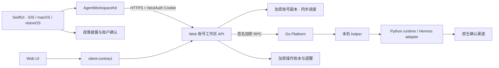

# 远程工作台兼容架构

[返回使用介绍](../README.md) · [安装与服务端版本要求](DEVELOPMENT.md#服务端版本与兼容检查)

本文记录 Apple 客户端的接口约定及配套 Web 架构。2026-09-27 更新以本机 deploy `65be7df57415197ab669a57bd4e5c68e6d1d8fec` 固定的 Web `78c019bf132e7b55e31b5987ba11617a6ba15662` 为接口基线；更新前 Apple 提交为 `f38f1e6ec6da2afb14486d0af7cffc4d438bb029`。共享模块目前包含 9 份协议 fixtures，覆盖工作区、控制回执、策略、Agent 提醒和会话结果提醒。源码比对、实际测试和线上部署状态应分别核对。

```mermaid
flowchart LR
    Apple[SwiftUI · iOS / macOS / visionOS] --> Kit[AgentWorkspaceKit]
    Kit -->|HTTPS + NextAuth Cookie| Web[Web 账号工作区 API]
    Browser[Web UI] --> Shared[client-contract]
    Shared --> Web
    Web --> Cache[加密账号副本 · 同步调度]
    Web -->|签名加密 RPC| Platform[Go Platform]
    Platform --> Helper[本机 helper]
    Helper --> Runtime[Python runtime / Hermes adapter]
    Runtime --> Native[原生确认渠道]
    Apple --> Policy[政策披露与账户确认]
    Web --> Ledger[加密操作账本与提醒]
```

## 边界

Agent runtime 是联系人、协作范围、确认、会话执行的权威来源。Web 提供账号、远程连接记录、控制台身份及加密同步副本。客户端不重新创建旧版 Web 业务数据库，不持有 Agent 身份私钥，也不绕过本机配对。

Web 将可复用的协议规则放在零运行依赖的 `packages/client-contract`，接口校验、客户端与后台同步直接复用该模块；其 JavaScript 实现、TypeScript 声明、JSON Schema 与 fixtures 为其他客户端提供接入参考。Swift 包不依赖相邻仓库路径，Xcode 工程只引用本仓库里的本地包；测试中保存协议 fixtures，避免两仓库运行时耦合。

## 已接入 API

| 路由 | 方法 | 客户端用途 |
| --- | --- | --- |
| `/api/auth/csrf`、`callback/credentials`、`session`、`register`、`signout` | GET/POST | NextAuth 会话与邮箱注册申请 |
| `/api/auth/account`、`resend-verification`、`forgot-password`、`change-password` | GET/POST | 邮箱状态与邮件确认流程 |
| `/api/workspace` | GET | 连接列表与同步状态 |
| `/api/agents` | POST | 保存真实 Agent 连接（仅 name、urn） |
| `/api/agents/:id/bind-owner` | POST | 注册/恢复同一个控制台身份 |
| `/api/agents/:id/workspace` | GET | 快照、会话、历史页及未决提交 |
| 同上 | POST | select_conversation、dismiss_submission |
| `/api/workspace/sync` | POST | 安排账号/Agent 同步 |
| `/api/agents/:id/control` | POST/GET | 按实际配对方法提交受限 RPC，并轮询同一个 request_id |
| `/api/platform-policy` | GET/POST/DELETE | 核验披露，明确确认、恢复或暂停 |
| `/api/agents/:id/workspace/operations` | GET/POST | 恢复账本、保存原请求、更新保守显示提示 |
| `/api/agents/:id/workspace/conversations` | GET/POST | 保存范围内的搜索与会话账户状态 |
| `/api/agents/:id/workspace/records` | POST | 隐藏或恢复账户联系人、协作记录 |
| `/api/agents/:id` | PATCH/DELETE | 连接重命名或删除账户连接及副本 |
| `/api/notifications` | GET/POST | 分页提醒与逐版本已读回执 |
| `/api/onboarding/claim/:code` | GET/POST | 核对一次性申请并明确授权 |

写请求必须携带与服务端 `NEXTAUTH_URL` 一致的 Origin；API 跳转会被拒绝，服务端认证失败使当前会话失效。新增功能使用工作区账户路由和已配对 Agent RPC，不重新启用旧 contacts/messages/hitl/transactions/service 业务路由。

控制方法现包括 `capabilities`、`contacts.list`、`collaboration.state`、`inbox.list`、`conversation.send`、`conversation.get`、`attention.list`、`contacts.add`、`approval.respond`、`contacts.requests`、`contacts.respond`、`messages.send`、`inbox.mark_read` 和 `collaboration.execute`。每项方法必须显式 `available=true` 并仍在有效配对期内；不知道的方法不执行，升级客户端不会增加旧配对权限。

## 政策与首次连接

`PolicyDisclosure` 的 `legacy` 状态表示没有可验证的 v2 策略；`signed` 状态包含平台、模式、epoch、策略 hash、网关密钥 ID 和账户确认状态。`can_use_workbench` 控制新远程读取、写入与同步；确认提交绑定当前展示的 hash，迟到读取不能覆盖明确确认或暂停。`policy_paused`、`policy_unavailable` 保留保存历史，不转换成需要配对。

一次性 `/connect/:code` 链接必须属于当前配置的工作区。确认前显示准确 Agent URN、方法与期限，并重新读取当前申请；`approved` 只是工作区授权，`completed` 才表示宿主已保存配对。账户控制台身份及托管证书由 Web 管理，手机不生成托管证书或持有身份私钥。

## 时间与关联规则

- workspace 快照、通知和同步时间使用毫秒；远程回合及原生 attention 时间使用秒。`sourceAt` 表示快照读取请求创建时刻，不能用响应到达时刻证明它在某项写入之后。
- 配对过期时间兼容 ISO8601、秒、毫秒，与共享模块的 fixtures 对齐；未授权方法不显示可执行入口。
- GET workspace 省略 conversation_id 表示恢复账号当前会话，空字符串表示新会话。两者不可合并。
- `conversation.send` 只携带 text 与可选 conversation_id。新对话默认使用 request_id；预期回合编号为 `turn-` 加 `SHA256(console_urn + NUL + request_id)` 的前 40 个十六进制字符。
- Swift 验证外层/内层请求编号、协议、类型、方法、result/error 互斥以及发送回执的 conversation_id/turn_id。签名、加密、Agent 与控制台身份等完整关联由 Web transport 验证。
- Web `d56bf35` 的请求身份和已保存发送记录按参数的 JSON 语义比较，不因不同语言的字典键顺序变化而改变；旧短期缓存中两种有效的会话参数顺序仍被接受，原密文与期限不变。Swift 保留 text 在前的稳定发送编码以兼容旧后端。规范化处理需要部署对应 Web 更新后才在线生效，见[共享模块的发布边界](https://github.com/BillShiyaoZhang/agent-collaboration-web/blob/d56bf3557141821290c4a996f4fe98df56b5395d/packages/client-contract/README.md#cross-client-retries-and-rollout)。
- 未决发送保存在 Keychain 写前日志中。查询失败不代表请求失败；重试复用原编号与参数。短期请求缓存过期后先读取对话核实，保留记录并继续由服务端实现，不伪造成功结果。

## 明确写入与恢复

好友申请与回应、普通消息、确切已读、审批回应及协作工具的原始 `PendingCall` 在服务端加密账本中先保存再投递。120 秒原投递期限不会因刷新、重试或 10 分钟传输缓存而延长；恢复账本只读取，不自动重放。终态由认证回执或确切对象事实确认，客户端的 `update` 只是保守提示，不能写出认证业务成功。

`messages.send` 使用稳定 `message_id`；`approval.respond` 使用不可变 `approval_id` 和明确 `approve`/`deny` 决定。审批提交前重新读取当前全文与对象；变更或已处理的问题不能由旧展示继续提交。未知协作执行结果保持 `uncertain`，不生成通用新请求重复业务效果；受理、投递、对端接受、双方同步与业务完成分别展示。

`collaboration.execute` 的 `action=describe` 是明确读取，不进入业务账本。其余动作按 Agent 返回的可用方法及字段核对，禁止伪造主人主体、会话或批准内容。可信 `source_context` 仅用于导航，不能从正文中的 ID 或对端声明推导额外权限。

联系人、协作隐藏状态属于账户视图，同种对象的 `relatedIds` 也要隐藏。删除连接会清除此账户保存副本，不能冒充取消执行或撤销配对。后端在处理中的回合、未确认账本或未结束对象存在时阻止相应删除。

## UI/UX

工作台负责连接、政策、配对、同步和概览；对话负责续聊、历史与发送恢复；协作汇集事项、确切审批、联系人及收件箱；提醒提供账户通知和原对象定位。窄屏四个底部入口和宽屏侧栏共享 Store。主界面使用系统明暗表面、可读状态文字、Dynamic Type、语义按钮与空状态；URN、快照等技术信息放在可展开详情。

发送区始终可见，换行不会误发送，桌面支持 Command-Return；查看旧消息时新进展提供跳转入口。同步异常保留已读内容并显示反馈；需要配对或未开放发送时说明原因并提供设置入口。

## 验证边界

实际结果见 [VALIDATION.md](VALIDATION.md)。历史 2026-09-14 记录只证明当时的原实现；本次测试按新契约重新核验。模拟网络、确定性 Store 与源码构建都不替代真实账户、真实 Agent 或签名分发验收。

本地 deploy 固定版本不改变已经运行的服务。共享模块的服务端修复需要部署到提供服务的 Web 实例；不能仅凭本仓库文档、客户端更新或 fixtures 比较推断公开服务已运行同一版本。原生后台推送、流式回复、附件和日历执行不属于本次已实现范围。
