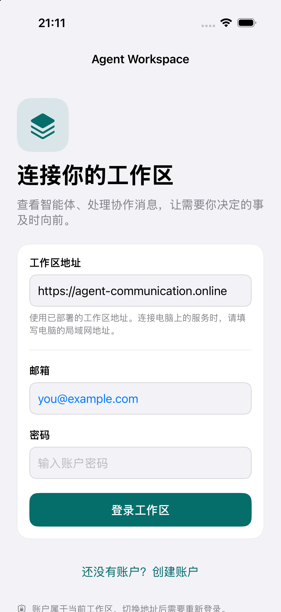
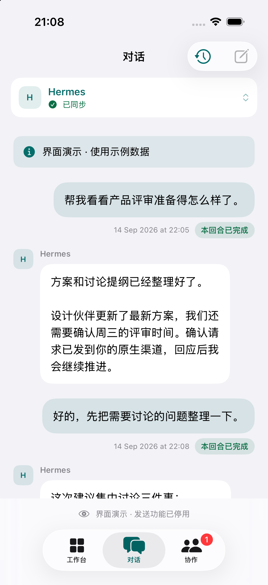
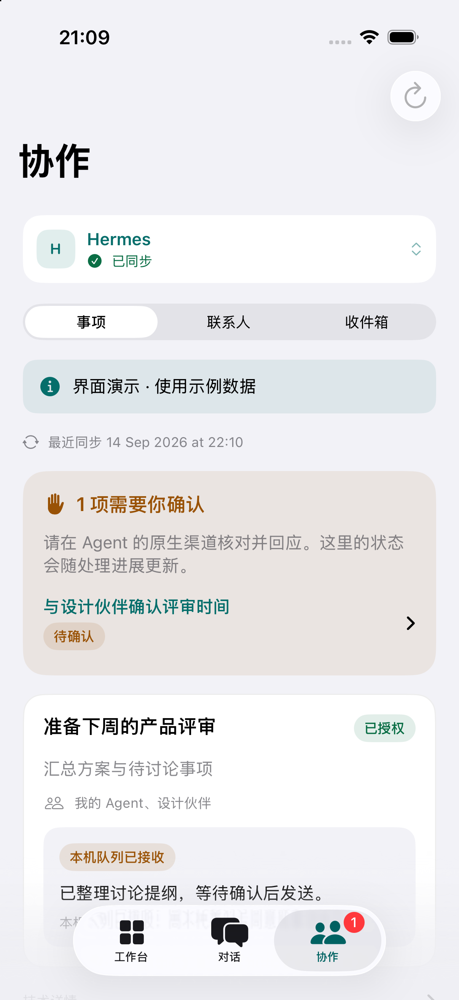
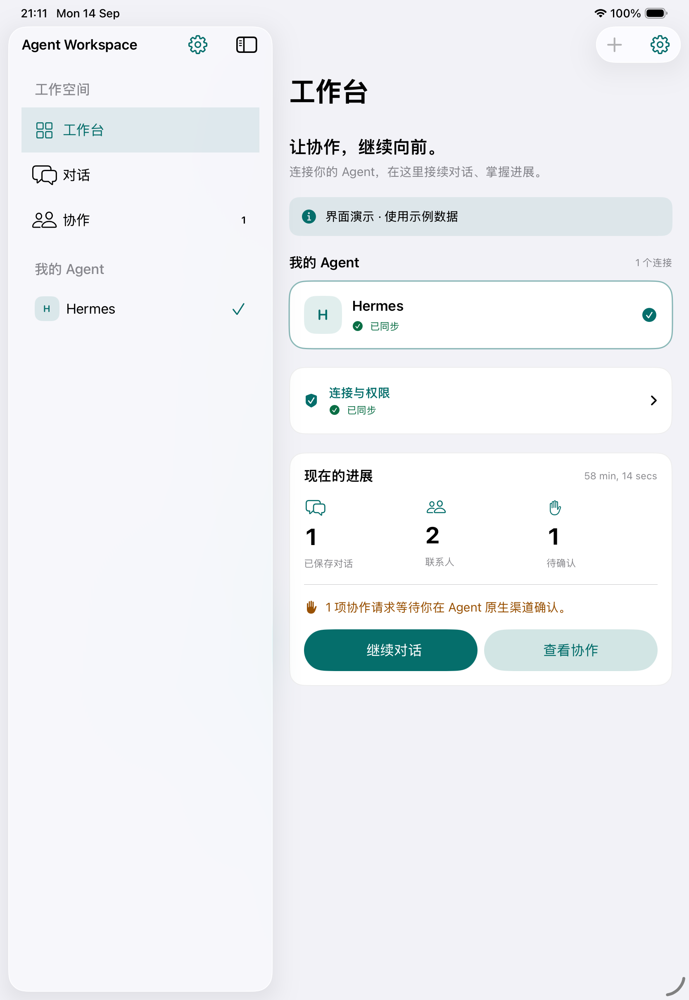

# 界面验证

以下截图来自运行新 SwiftUI 应用的 iOS 26.5 模拟器。演示数据有明确标识，不连接真实 Agent；登录截图跳过会话恢复。

| 登录 | 对话 | 协作 |
| --- | --- | --- |
|  |  |  |

工作台把连接、配对、同步和待确认概览集中到一个入口；对话使用独立历史选择、持续可见的发送区及不确定结果恢复操作；协作页在事项、联系人和收件箱之间切换。页面使用系统字号、明暗表面及文字+图标状态，不仅依赖颜色表达结果。

布局验证覆盖 iPhone 窄屏和 iPad 宽屏；macOS 与 visionOS 已完成编译验证。网络与多设备恢复交互由 Swift URLProtocol 测试、真实 Store 的确定性回归脚本和 Web 测试覆盖。尚未进行真实账号与运行中 Agent 的端到端交互验收。
