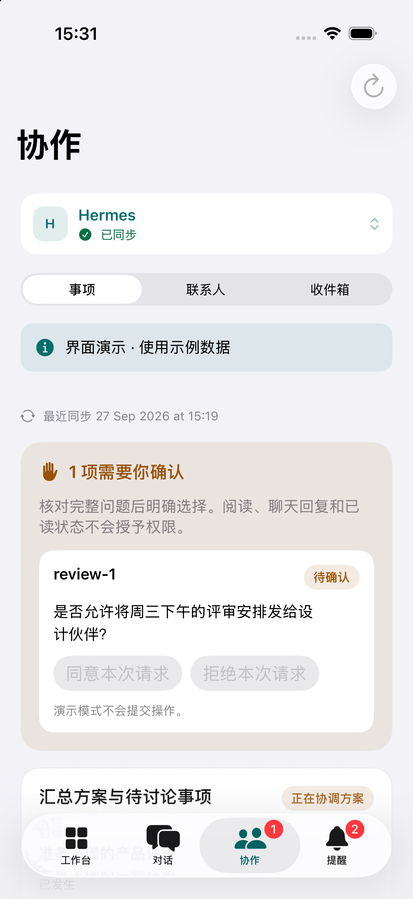
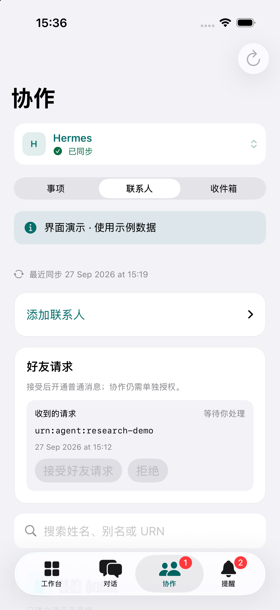
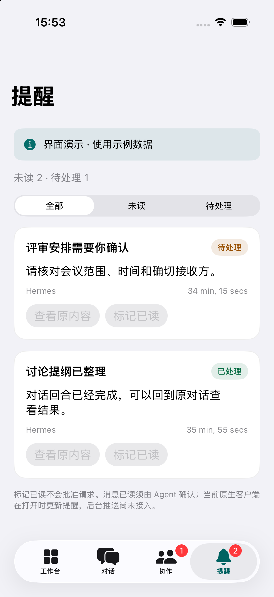
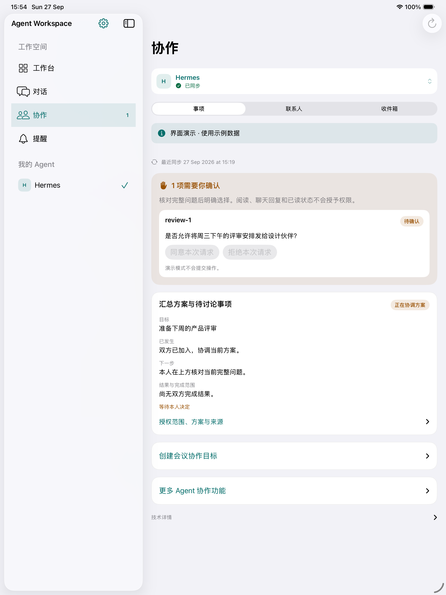
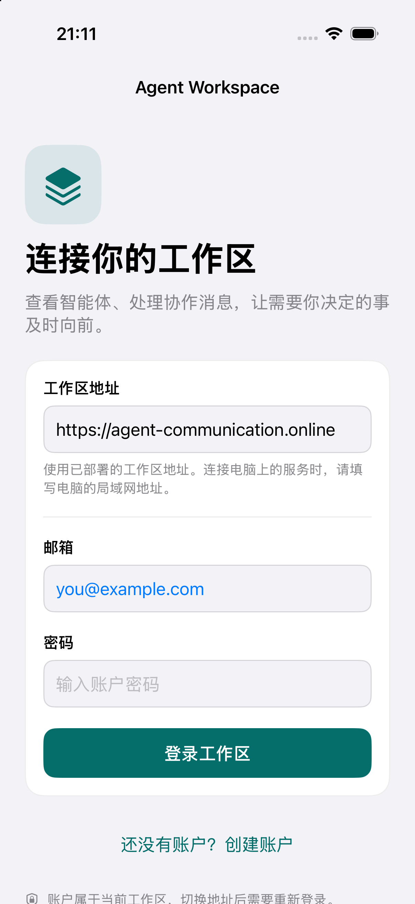
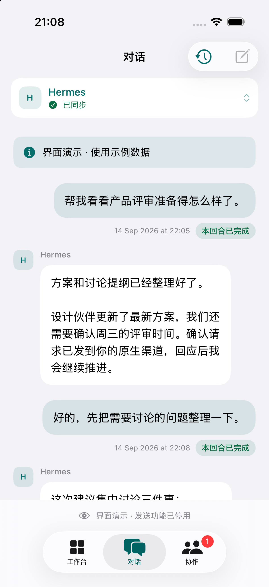
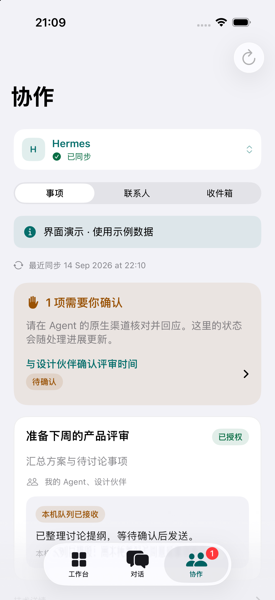
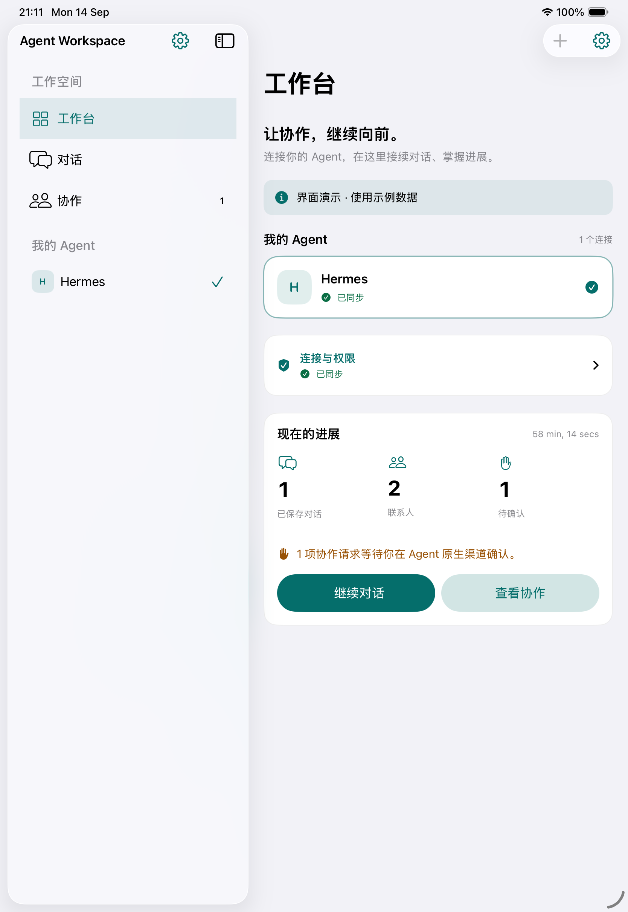

# 界面验证

## Apple 设计检查补充 · 2026-09-27

系统检查与逐项修正见 [APPLE_DESIGN_AUDIT.md](APPLE_DESIGN_AUDIT.md)。本轮检查普通字号及最大辅助字号、深色、Increase Contrast、iPad 侧栏、完整审批换行，并修正字段焦点、VoiceOver语义、Reduce Motion、触控区域和动态列表身份。

本轮截图使用合成演示数据，见审计报告中的三张新证据。对话键盘检查受到模拟器首次键盘引导影响，未完成连续输入；完整辅助技术交互、真实设备、账户删除和共享许可页面的实际朗读/焦点仍未验收。代码编译和隔离测试不能替代这些检查。

## 本次更新 · 2026-09-27

本次界面新增政策披露、一次性连接申请、邮箱验证与密码邮件入口、连接管理、提醒中心、好友与消息操作、确切审批和 Agent 协作工具。底部导航与宽屏侧栏均增加“提醒”。原有截图是 2026-09-14 的布局证据，不能据此声称新增流程已经完成视觉或真实账户验收；本次实际构建及测试结果见 [VALIDATION.md](VALIDATION.md)。

新增流程需要核对的页面包括：政策确认与暂停、一次性申请的范围和状态、好友申请/消息/完整审批的确认页、未知写入恢复提示、提醒筛选与原对象跳转，以及邮箱注册后的验证反馈。业务交互先用合成数据与模拟 transport 验证；真实账号、实体设备、辅助功能使用与后台通知需要单独验收。

本次已查看 iPhone 模拟器协作、联系人和提醒页截图，以及 iPad 宽屏协作页。四个导航入口、完整审批问题、好友请求、提醒计数与筛选可见，当前视口未发现文字或按钮裁切。各页有明确的演示标识，业务写入按钮均禁用。这些截图只验证展示，不验证真实审批投递、原对象跳转或其余表单状态。

| 联系人 | 提醒 |
| --- | --- |
|  |  |

Debug 的 `--demo-workspace --demo-notifications` 可打开提醒页布局，追加 `--demo-collaboration`、`--demo-contacts` 或 `--demo-inbox` 可检查对应协作分区。所有演示页面保持明确标识并禁止发送和审批写入。

## 历史布局检查 · 2026-09-14

以下截图来自运行当时 SwiftUI 应用的 iOS 26.5 模拟器。演示数据有明确标识，不连接真实 Agent；登录截图跳过会话恢复。

| 登录 | 对话 | 协作 |
| --- | --- | --- |
|  |  |  |

工作台把连接、配对、同步和待确认概览集中到一个入口；对话使用独立历史选择、持续可见的发送区及不确定结果恢复操作；协作页在事项、联系人和收件箱之间切换。页面使用系统字号、明暗表面及文字+图标状态，不仅依赖颜色表达结果。

布局验证覆盖 iPhone 窄屏和 iPad 宽屏；macOS 与 visionOS 已完成编译验证。网络与多设备恢复交互由 Swift URLProtocol 测试、真实 Store 的确定性回归脚本和 Web 测试覆盖。尚未进行真实账号与运行中 Agent 的端到端交互验收。
